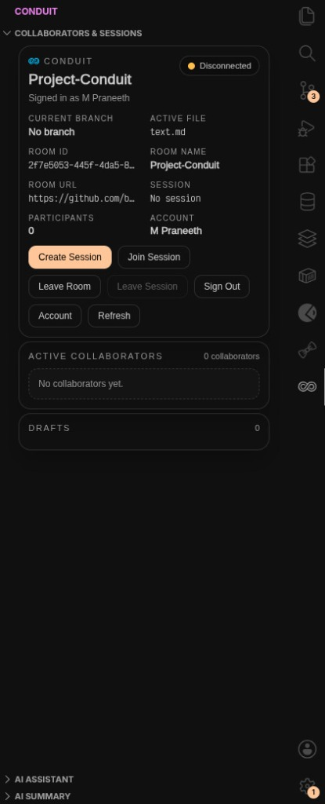
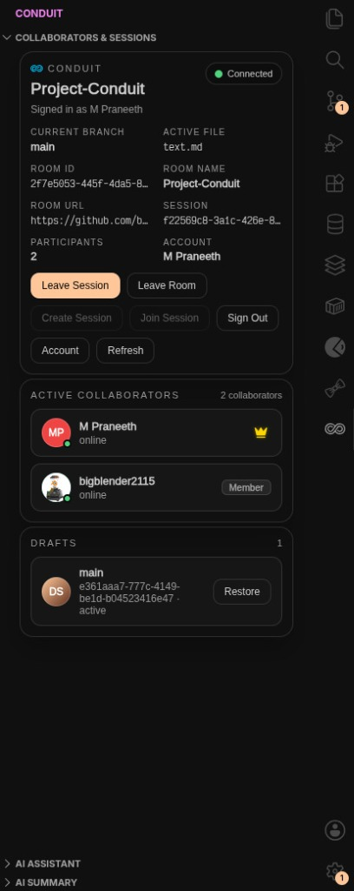
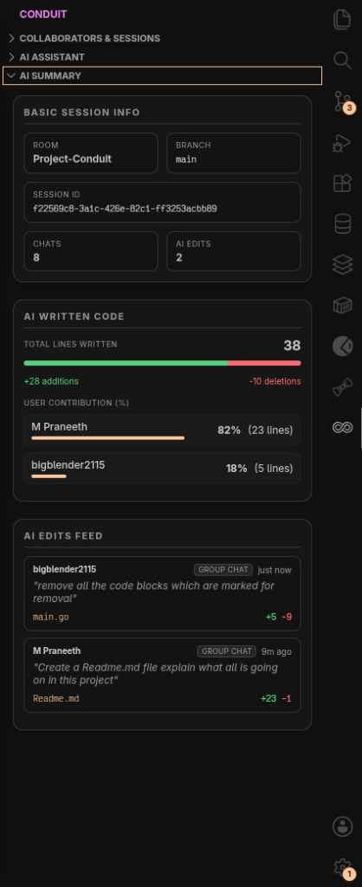

# 🌀 Conduit

Conduit is a premium real-time collaborative development extension for VS Code that enables seamless multiplayer coding sessions directly within the IDE. Utilizing high-performance CRDT synchronization (via Yjs), Git-integrated session branches, cloud draft persistence, and AI-powered voice capabilities (powered by Sarvam AI), Conduit brings Figma-like collaborative speed to your codebase editor.

---

## ✨ Core Features

- 👥 **Real-time Multiplayer Collaboration**: Create or join shared room sessions to edit code files simultaneously with live cursor tracks, selection ranges, and presence indicators.
- 👑 **Collaborator Roles & Identity**: Distinct participant badges (such as Room Owner marked by a styled golden Crown icon) and GitHub avatar integration.
- 🎙️ **Sarvam AI Voice Integration**:
  - **Speech-to-Text (STT)**: Direct microphone voice capture with a pulsing record animation (synchronized with backend `arecord` processes) and dynamic spinner states during transcription.
  - **Text-to-Speech (TTS)**: Dynamic text-to-speech narration of AI responses supporting English and multiple regional Indian languages (Hindi, Telugu, Tamil, Kannada, Malayalam, Bengali, Gujarati, Marathi, Punjabi, Odia) with clean Lucide-based SVG icons.
- 💾 **Draft Persistence & Recovery**: Voluntary and session-disconnect safety nets that auto-save drafts to the database, allowing seamless session restoration.
- 🎨 **Dynamic VS Code Theme Integration**: Webviews utilize VS Code native CSS custom properties (like `var(--vscode-button-background)` and `var(--vscode-focusBorder)`) to seamlessly match any active light, dark, or high-contrast theme.

---

## 📸 UI Showcase

<p align="center">
  
  
  
</p>

---

## 🏗️ Monorepo Architecture

Conduit is managed as a monorepo using `pnpm` workspaces:

```
Conduit/
├── apps/
│   ├── extension/      # VS Code Extension (TypeScript, Webviews)
│   ├── backend/        # Collaborative Signaling & Persistence Server
│   └── dashboard/      # Web-based management dashboard
├── packages/
│   ├── ai-core/        # Shared AI API bindings (Sarvam AI integration, etc.)
│   ├── collaboration-  # Shared CRDT / Yjs syncing infrastructure
│   │   core/
│   ├── git-core/       # Git workspace utils, branch registry, & diff utilities
│   └── shared-types/   # Common TypeScript definitions
```

---

## 🚀 Getting Started

### Prerequisites

- [Node.js](https://nodejs.org/) (v22 or higher recommended)
- [PNPM](https://pnpm.io/) (v10.8.0 or higher)
- VS Code (for running the extension)
- Linux environment dependencies (e.g., `arecord` for voice recording)

### Installation

Clone the repository and install the workspace dependencies:

```bash
pnpm install
```

### Workspace Commands

Run tasks across all monorepo apps and packages simultaneously:

- **Build all projects**:
  ```bash
  pnpm build
  ```
- **Typecheck code**:
  ```bash
  pnpm typecheck
  ```
- **Lint the codebase**:
  ```bash
  pnpm lint
  ```
- **Format code**:
  ```bash
  pnpm format
  ```

---

## 🛠️ Development & Debugging

1. **Running the extension locally**:
   - Open the workspace in VS Code.
   - Press `F5` or navigate to the "Run & Debug" sidebar and select **Run Extension**.
   - This opens a new VS Code window (Extension Development Host) running Conduit.
2. **Environment Variables**:
   - Create a `.env` file in `apps/backend` and `apps/extension` as needed, configuring Supabase URL/keys and optional Sarvam AI API keys.
